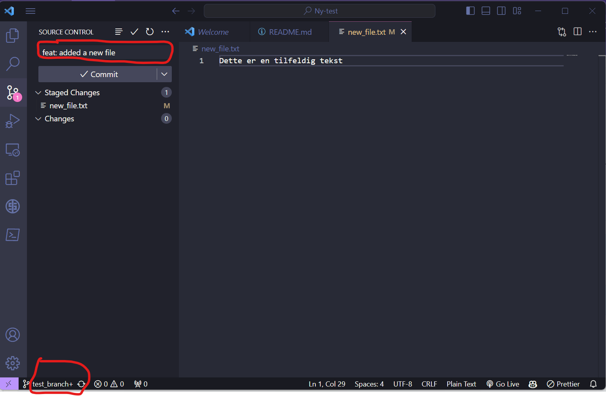

# Git og GitHub Workshop med Eik

Velkommen til Git og GitHub workshop! Denne workshopen er ment å gi deg en grunnleggende forståelse av hvordan du kan bruke Git og GitHub til å administrere og samarbeide om prosjekter.

# Innhold

- [1. Innledning til Git og GitHub](#innledning-til-git-og-github)
- [2. Før vi setter ignag](#før-vi-setter-ignag)
- [3. Grunnleggende konsepter](#grunnleggende-konsepter)
-
- [Arbeidsflyt](#arbeidsflyt)
- [Samarbeid](#samarbeid)
- [Ressurser](#ressurser)

# 1. Innledning til Git og GitHub

Git er et distribuert versionskontrollsystem som hjelper deg med å spore endringer i filer over tid. GitHub er en plattform for samarbeid og deling av Git-repositorier. I denne workshopen vil du lære hvordan du bruker Git til å administrere prosjekthistorikk og hvordan du samarbeider på GitHub.

# 2. Før vi setter ignag

## 2.1 Installasjon av GIT
Før vi begynner, må du sørge for at Git er installert på datamaskinen din. Du kan laste ned Git fra [https://git-scm.com/](https://git-scm.com/) og følge instruksjonene for din plattform.

### Windows
For å sjekke om Git er installert, kan du åpne et terminalvindu og kjøre følgende kommando:
```bash
git --version
```
Hvis Git er installert, vil du se versjonsnummeret. Hvis ikke, kan du følge instruksjonene på [https://git-scm.com/download/win](https://git-scm.com/download/win) for å installere Git.

### macOS
For å sjekke om Git er installert, kan du åpne et terminalvindu og kjøre følgende kommando:
```bash
git --version
```
Hvis Git er installert, vil du se versjonsnummeret. Hvis ikke, kan du følge instruksjonene på [https://git-scm.com/download/mac](https://git-scm.com/download/mac) for å installere Git.

## 2.2 Oppsett av Git-konfigurasjon
Vi skal  nå konfigurere Git med navn og e-postadresse. Dette er viktig fordi Git bruker denne informasjonen til å identifisere forfatteren av hver endring. Du kan bruke følgende kommandoer for å konfigurere Git:

```bash
git config --global user.name "Your Name"
```
```bash
git config --global user.email "youremail@example.com"
```

For å se at konfigurasjonen er lagret, kan du kjøre følgende kommandoer:

```bash
git config --global user.name
```
```bash
git config --global user.email
```
Du bør nå se navnet og e-postadressen du har konfigurert.


## 2.3 Oppsett av GitHub-konto
Hvis du ikke allerede har en GitHub-konto, kan du opprette en på https://github.com/

## 2.4 Laste ned VS Code
Vi skal bruke VS Code til å jobbe med Git og GitHub. Du kan laste ned VS Code fra [https://code.visualstudio.com/](https://code.visualstudio.com/).

# 3. Lag et nytt repository
Nå som du har installert Git og konfigurert brukernavn og e-postadresse, er du klar til å opprette et nytt repository og begynne å spore endringer!

## 3.1 Logg inn på GitHub:

## 3.2 Opprett et nytt repository:
   - Klikk på **New**-knappen i øverste venstre hjørne.
   
   - Gi repositoriet et navn, legg til en beskrivelse om du vil og velg om du vil gjøre repositoriet offentlig eller privat.
   
    Bruk gjerne privat hvis du ikke vil at andre skal kunne se koden din.
   - Klikk på **Create repository**.  

## 3.3 Kopier URL-en til repositoriet:
   - Klikk på den grønne **Code**-knappen.
   - Velg SSH og kopier URL-en som kommer opp.
    


## 3.4 Klon repositoriet til din maskin:
   - Åpne VS Code og velg **Clone repository**.
   - Skriv inn URL-en du kopierte fra GitHub og velg hvor du vil lagre repositoriet på din maskin.
   


# 4. Grunnleggende konsepter
Nå er vi klare til å begynne å bruke Git! I denne delen vil vi dekke noen grunnleggende konsepter og kommandoer som du vil bruke når du arbeider med Git og GitHub.

- **Repository**: Et sted der prosjektfilene og -historikken er lagret.
- **Commit**: En snapshot av endringer i prosjektfilene dine.
- **Branch**: En gren av prosjektet som lar deg arbeide isolert med nye funksjoner eller endringer.
- **Merge**: Sammenføyning av endringer fra en gren til en annen.
- **Pull Request**: En forespørsel om å samle endringer fra en gren til en annen (spesielt på GitHub).
- **Fork**: En kopi av et repository som du eier og kan endre.

# 5. Jobb med prosjektet fra VS Code
Nå som du har klonet repositoriet til din maskin, kan du begynne å jobbe med prosjektet. Du kan åpne prosjektet i VS Code ved å velge **Open folder** og velge mappen du klonet repositoriet til.

## 5.1 Lag en README.md fil:
- I VS Code, trykk på **New File**-knappen i venstre hjørne.
- Skriv inn navnet **README.md** og trykk enter.
- Skriv inn en beskrivelse av prosjektet ditt i README.md filen.


## 5.2 Commit og push filen til GitHub:
   - Commit filen ved å trykke på **Source Control** i menyen til venstre og **Commit**.
   - Hold musepekeren over **README.md** og trykk på **+** for å stage filen.
   - Skriv inn en commit message og trykk på **Commit** (se commit_message.md for tips til gode commit messages).
   - Trykk på de tre prikkene i venstre hjørne og velg **Push**.
   - Nå skal README.md filen din være på GitHub.
   

# 6. Branching og merging
Nå som du har opprettet et repository og lagt til en README.md fil, kan du begynne å jobbe med prosjektet ditt. En god måte å organisere arbeidet ditt på er å bruke branches. En branch er en gren av prosjektet som lar deg arbeide isolert med nye funksjoner eller endringer. Når du er ferdig med endringene dine, kan du sammenføye dem med hovedgrenen ved å gjøre en merge.

## 6.1 Opprett en ny branch:
   - Klikk på **main**-knappen helt nede i venstre hjørne. Dette er navnet på hovedgrenen. Du blir nå tatt til søkefeltet hvor du får mulighet til å trykke på **Create new branch**. Skriv inn navnet **test_branch** på den nye grenen din. Du vil nå se at du har byttet til den nye grenen når du ser på navnet helt nede i venstre hjørne.
   - Du jobber nå i en ny gren av prosjektet ditt, men andre ord en kopi. Du kan gjøre endringer i prosjektet ditt og committe dem til den nye grenen.
   - Når du er ferdig med endringene dine, kan du sammenføye dem med hovedgrenen ved å gjøre en merge.
   
  
## 6.2 Legge til en ny fil i den nye grenen din:
   - Lag en ny fil ved å trykke på **New File**-knappen i venstre hjørne.
   - Skriv inn navnet **new_file.txt** og trykk enter.
   - Skriv inn en en tilfeldig tekst i new_file.txt filen.
- Commit filen ved å trykke på **Source Control** i menyen til venstre, stage filen ved å trykke på **+** og commit filen ved å skrive inn en commit messageen **feat: added a new file** og trykke på **Commit & push**.


## 6.3 Pull request:
   - Nå som du har gjort endringer i den nye grenen din, kan du gjøre en merge med hovedgrenen.
   - Gå inn på repoet ditt på GitHub. Du vil nå se en **Compare & pull request**-knapp. Trykk på denne.
- Du vil nå se en oversikt over endringene du har gjort i den nye grenen din. Trykk på **Create pull request**.


## 6.4 Godkjenne pull request:
- Du vil nå se en forespørsel om å sammenføye endringene i den nye grenen din med hovedgrenen. Trykk på **Merge pull request** og deretter **Confirm merge**.

- Du har nå gjort en merge av endringene i den nye grenen din med hovedgrenen. Du kan nå slette den nye grenen din ved å trykke på **Delete branch**.

- Grenen du ga navnet **test_branch** er nå blitt slettet og du er tilbake til hovedgrenen.
- I VS Code kan du nå trykke på **Pull**-knappen for å hente endringene fra GitHub.
- Du vil forsatt være i **test_brach** i VScode selv om den er slettet fra ditt repo. Du kan nå trykke på **main**-knappen helt nede i venstre hjørne og velge **main** for å bytte til hovedgrenen. Eller lage en ny branch og bytte til denne.


# 7. Merge conflicts
Merge conflict oppstår når endringer i en gren ikke kan sammenføyes med endringer i en annen gren. Dette kan skje når to personer gjør endringer i samme fil, eller når en person gjør endringer i en fil og en annen person sletter filen. Når dette skjer, må du løse konflikten manuelt.

Gå sammen to og to i grupper og gjør følgende:
## 7.1 Person A gjør sitt repo offentlig:
- Gå inn på repoet ditt på GitHub.
- Trykk på **Settings**.
- Bla ned til **Danger Zone** og trykk på **Make public**.
- Trykk på **I understand, make this repository public**.

## 7.2 Person B cloner repoet:
- Gå inn på repoet til den andre personen.
- Trykk på **Code**-knappen og kopier SSH URL-en.
- Åpne VS Code og velg **Clone repository**.
- Skriv inn URL-en du kopierte fra GitHub og velg hvor du vil lagre repositoriet på din maskin.

## 7.3 Person A gjør endringer i en fil:
- Person A lager en ny branch med navnet **person_A** og passer på at han er på denne grenen.
- Person A skal nå gjøre endringer i filen **New_file.txt** og committe & pushe endringene.


## 7.4 Person B gjør endringer i samme fil:
- Person B skal nå lage en ny branch med navnet **person_B** og passe på at han er på denne grenen.
- Person B skal nå gjøre endringer i filen **New_file.txt** og committe & pushe endringene.

## 7.5 Pull request:
- Person A skal nå gjøre en pull request og merge endringene sine med hovedgrenen. Dette skal gå fint.
- Person B skal nå gjøre en pull request og merge endringene sine med hovedgrenen. Dette skal ikke gå fint. Person B vil nå få en merge conflict.
- Dere må nå manuelt løse konflikten.
- Når konflikten er løst, kan dere gjøre en merge av endringene i den nye grenen deres med hovedgrenen.


