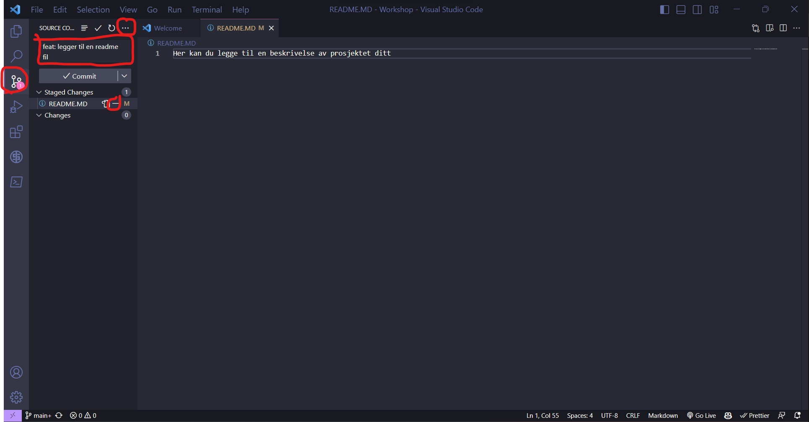

# Hvordan komme i gang med VS Code og GitHub

1. **Du må ha clonet repoen din fra GitHub til din maskin:**
   - Åpne VS Code og velg **Clone repository**.
   - Skriv inn URL-en du kopierte fra GitHub og velg hvor du vil lagre repositoriet på din maskin (som beskrevet i punkt 4 i  oprette_repo.md).
   

2. **Lag en README.md fil:**
   - I VS Code, trykk på **New File**-knappen i venstre hjørne.
   - Skriv inn navnet **README.md** og trykk enter.
   - Skriv inn en beskrivelse av prosjektet ditt i README.md filen.
   

3. **Commit og push filen til GitHub:**
   - Commit filen ved å trykke på **Source Control** i menyen til venstre og **Commit**.
   - Hold musepekeren over **README.md** og trykk på **+** for å stage filen.
   - Skriv inn en commit message og trykk på **Commit** (se commit_message.md for tips til gode commit messages).
   - Trykk på de tre prikkene i venstre hjørne og velg **Push**.
   - Nå skal README.md filen din være på GitHub.
   