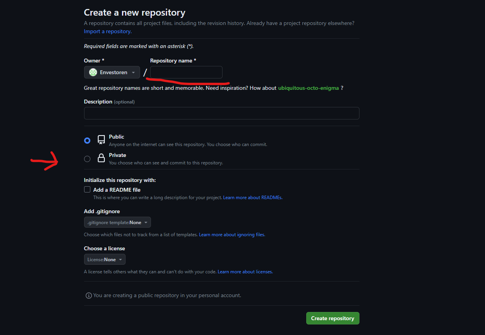
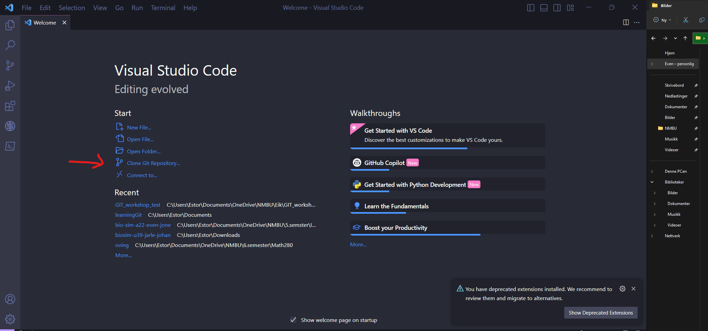

# Hvorsan oprette et repo i GitHub

1. **Logg inn på GitHub:**  

2. **Opprett et nytt repository:**
   - Klikk på **New**-knappen i øverste venstre hjørne.
   
   - Gi repositoriet et navn, legg til en beskrivelse om du vil og velg om du vil gjøre repositoriet offentlig eller privat.
   
    Bruk gjerne privat hvis du ikke vil at andre skal kunne se koden din.
   - Klikk på **Create repository**.  

3. **Kopier URL-en til repositoriet:**
   - Klikk på den grønne **Code**-knappen.
   - Velg SSH og kopier URL-en som kommer opp.
    

4. **Klon repositoriet til din maskin:**
   - Åpne VS Code og velg **Clone repository**.
   - Skriv inn URL-en du kopierte fra GitHub og velg hvor du vil lagre repositoriet på din maskin.
   

